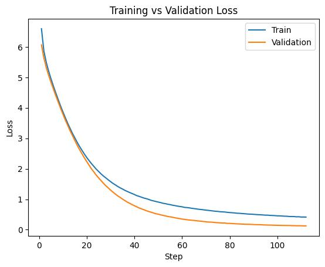

# Summary 
A trasnformer implementation using pytorch. This is an encoder-decoder style transformer-based language model trained on Twitter's post dataset. The goal is to predict the next tweet in a given thread using the previous tweet. The model achieve near perfect memorization of the test set due to small sized datatset used. 

# Table of Contents
- [Repo Content](#repo-content)
- [Key Features](#key-features)
- [Result](#result)
- [Lesson Learnt and Troubleshooting](#lesson-learnt-and-troubleshooting)
- [Limitation](#limitation)

# Repo Content 
- multi_headed_attention.py: an implementation of multi-headed attention mechanism with argument for passing in padding and casual attention mask. This is the foundation upon which the encoder and decoder module is built on. 
- encoder.py: consist of multi_headed_attention, linear layer, normalization layer and drop out layer. This is used to encode the global context of our input and pass it to the decoder.
- decoder.py: consist of similar module to the decoder, however, its argument accept two mask: the padding mask for the decoder itself and the cross attention mask for the output of the encoder 
- transfomer.py: an implementation of the overall transformer model. Consist of n stacks of encoder and decoder layer as well as function for training and prediction. 

# Key Features
need to direct people to result and lesson learnt with a link 

## Triangular mask
During the forward function inside multi_headed_attention.py, we produce an attention matrice which represent the "attention score" of one token to every other token. This "attention score" represent how closely related each token is to each other. However, we must ensure that the current token only have access to the token before it, not after. This ensure that the model can't see future context beforehand. To this extent, an upper traingular mask is used to invalidate the attention score of future token. In a nutshell, the attention score is set to -inf for any case token after the current token which ensure that it will output to zero after applying softmax function. 

## padding mask
Batch processing required every training data to have the same length. This is a requirement for such parallelization but in seq2seq modeling such as our twitter dataset, not every tweet is the same length. Therefore, in order to take advantage of parallization, we chose a max lenght and pad any sequence whose len is shorter than that max lenght. However, padding (usually all zero) could mess with our training by contaminating the gradient, therefore a padding mask is used to invalidate those padding timestep. Similar to triangualr mask, we set the attention score to -inf which ensure output it zero after softmax. 
## Positional Embedding
A key design feature of the attention mechanism is that it doesn't have any awareness of the order between token. Therefore, in order to enforce, in this case, the order of word in the sentence, we inject positional information through Sinusoidal Positional Encoding.
## Dropout
a dropout of 0.1 was used for both the encoder and decoder in order to ensure the model doesn't overfit during training.

## Teacher Forcing and objective function
While this is a generative model, the model use ground truth data at time t to predict the output at t+1 instead of its own sampled output. This ensure training stability and ensure that the model doesn't drift with its own noisy output during early training stage 

# Result

## Dataset
The dataset is a small collection of public tweet thread. There are multiple tweets in each threads. training data is generated using the current tweet as the input and the next tweet as 

## train and validation loss
The model was train on 8:2 train/validation split and converged after 100 epochs. Train loss is higher than validation loss due to dropout and weight decay regularization.  
** insert loss graph here
<table>
<tr>
<td align="center">
 
</td>
</tr>
</table>

## Generation quality 
Due to the small dataset size, at the current validation loss value the model achieve perfect memorization of the validation. Some sample output is shown in the table below. 
<table>
<tr>
<td>
Input text
</td>
<td>
Target Text
</td>
<td>
Output Text
</td>
</tr>
<tr>
<td>
six flags will indicate that expansion of holiday event should bring in new revenue, but trend of per cap spending drops shouldnt be ignored
</td>
<td>
very real possibility that their business plan is beginning to hit a wall. expanding season passholder base has natural limits.
</td>
<td>
very real possibility that their business plan is beginning to hit a wall. expanding season passholder base has natural limits.
</td>
</tr>
<tr>
<td>
what is the pinnacle of artificial fruit? this is a debate i am for atm
</td>
<td>
well i would say skittles but also starburst are up there
</td>
<td>
well i would say skittles but also starburst are up there
</td>
</tr>
<tr>
<td>
idkkk i think they win i dont know i think they'll win more than blazers

</td>
<td>
idk actually about dame either bc i don't think the blazers or thunder will be seeded higher than 6

</td>
<td>
idk actually about dame either bc i don't think the blazers or thunder will be <mark>seedededed</mark> higher than 6
</td>
</tr>
 <tr>
<td>
woah, if we did wager something, what would we have done?!
</td>
<td>
 dang! fantastic question. i guess we would have to agree to wait for the next one on 12/24, yeah?
</td>
<td>
 dang! fantastic question. i guess we would have <mark>to agree to agree</mark> to wait for the next one on 12/24, yeah?
</td>
</tr>
</table>
# Model Detail

# Lesson Learnt and Troubleshooting
## tokinzer
Initially single character tokenization was used, but because the training took slightly longer because the model have to learn from char to word to sentence level mapping, subword tokenization was used instead.

In subword tokenization, the dictionary size play a big role in training stability. a good rule of thumb is to choose the dictionary in such a way that make sense to the language structure we are modeling. for example, sweetness should tokenize to "sweet" and "ness"

## cross attention mask mismatch
*** insert cross attention here 
The encoder and decoder is connected by a cross attention pathway. However, different sequence was used to train the encoder and decoder so the input padding is different. Therefore we must ensure that we use the encoder mask for cross attention score and decoder mask for self attention score in the decoder. 

## posterior collapse
This model was built after I built Sketchrnn. One thing that had been bugging me is that they are both encoder-decoder style model but why do transformer doesn't suffer from psoteior collapse like sketchrnn. The key is how we define each model lose function. In sketchrnn, the loss function include a KL-divergence loss which the model can collapse immediately making the encoder output zero as a way to reduce the loss. In transformer, we only have cross entrophy loss so there was no pathway to cheat to begin with.

# Limitation 
This model was trained on tweet corpus so it primiarily learnt short form, plaform specific style. While it can memorize that predict the next tweet at near perfect accuracy, this does not translate long-form conherence, factual reliability or ability to follow instruction.
